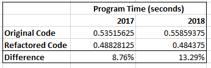

# stock-analysis for Steve
## Project Overview
### Purpose
The purpose of this analysis was to view performance over time for different stocks in order to help the client decide which stocks they might want to invest in. Additinally, the purpose of this coding excercise was to refactor working code to make a more efficient and effective macro by which with the client can do future analyses. The two performance of the stocks are analyzed and the performance of the two programs are compared against one another.

## Results
The VBA Challenge spreadsheet includes 3 buttons, one to run the stock analysis with the original program (VBA macro "yearValueAnalysis"), one to run the stock analysis with refactored code (VBA macro "AllStocksAnalysisRefactored), and one button to clear the sheet between runs. Both analysis buttons start with an input box for the user to input on which year they would like to run the analysis. Stock performance for both years are analyzed below and the code performance for both programs are measured against one another as well.

### stock performance for 2017
The following image displays the performance of 12 different stocks (displayed in the 'Ticker' column) from the beginning to end of 2017. The total daily volume equates to how many stocks were traded and the return is how much the stock value changed from the first day to the last trading day of the year. It can be seen from inspecting the colored 'return' row from the tabel that many of the stocks had a positive return for the year, but DQ had the highest return at 199% return. The stock that had the highest trade volume in 2017 was SPWR with over 782,000 trades.

### stock performance for 2018

The following image shows the performance of the same 12 stocks in the year 2018. As can be seen quickly from inspection, there is a lot more red, and therefore stocks with negative returns. In fact, only two stocks had positive returns for the year, both just above 80% and those are ENPH and RUN. ENPH performed very well in 2017 too, and its trade volume increased from 2017 to 2018 and so it might be worth the investor taking a look at in the future.

### comparing analysis programs

 Both analysis programs run similarly, using nested for loops and if-then statements to loop over the rows for each stock ticker. However, an advantage of the refactored code, is that it stores all of the output values in arrays, for each ticker. So at any time the total daily volume, start and end prices, and yearly returns can be printed out. In the first program, the output lies within the main for loop, and there are no output arrays, so each resulting value is output to the sheet and then the variable value is rewritten for the next ticker on the next pass over the loop. In the refactored code the final values are stored in arrays with a size of 12 values (i = 0 to 11) one for each stock ticker used in this spreadsheet. The arrays are then output on the spreadsheet using a simple for loop from i = 0 to 11.

 As for the performance of the refactored code versus the original code, the following image displays a table with the time it took for both programs to analyze the data for 2017 and 2018.

While the programs do not run exactly the same speed each time, due to computer utilization, The refactored program is nearly 10% faster for both years, and if this is extrapolated to longer datasets, or many runs are needed to be performanced in sequence, 10% faster can add up in computing time. It is definitly advantages to use the refactored program for further stock analysis if data were added to the spreadsheet, such as more tickers or more years of data.

## Summary

To summarize what took place in this challenge, the original program from the lesson material used to analyze stock data, was refactored to be more robust. Refactoring code means taking a working program and editing it to make improvements. Improvements can come in the form of adding clearer comments and making the code more readable, to structing the program and using different functions to more efficiently accomplish the task of the program, or finally to be more robust, such as in the case of this example storing all values calculated in arrays, instead of rewriting the value of each variable after it is output. 

Advantages of refactoring code are as listed above, in having an improved program in various ways, and having additional eyes on the code. Disadvantages of refactoring code come mostly in the form of engineering work hours. It takes time to refactor code and it might not be worth the engineering hours to do so in certain cases. In the case of this VBA script, the pros of having a faster and more robust program by using a different for loop structure outweights the con of the extra couple hours it took to produce a working refactored program.